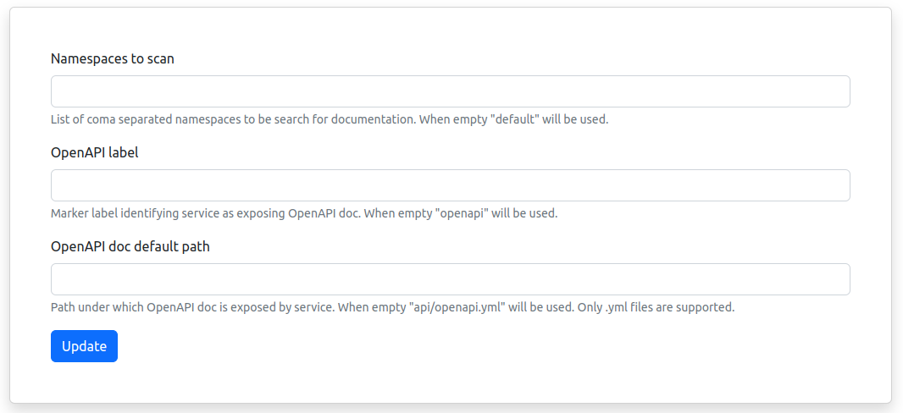

# beholder


>Documentation search engine with K8S first approach.

### Motivation
Common approach with service documentation delivery is to use tools like https://swagger.io or https://apiary.io to read documentation from project repo and make it accessible over service page.

Beholder take different approach. It uses services deployed to K8S cluster as carriers of the documentation files.

There is no need for external service serving the doc. There is no ambiguity which version of documentation is deployed to the specific environment.

### Requirements

* Elastics Search (tested with version 7.17.6)
* Kubernetes (tested with version 1.23.3)

### Installation

First of all, you need to deploy Beholder to K8S cluster. Beholder will need to have access to two things:

* K8S API 
* ES instance 

Next we need to build docker image. Update `Dockerfile.prod` file by replacing `<ES_HOST>` placeholder with ES hosts urls.  

To build Beholder docker image use command below:

```shell
docker build . -t beholder:1.0.0 -f Dockerfile.prod
```

After the deployment you need to grant permissions to K8S API. Example below shows how necessary list of privileges can be set. 
By no mean it's an optimal way but a showcase of the requirements.     

```shell
kubectl apply -f ./infra/k8s/ClusterRole.yml

kubectl create clusterrolebinding service-reader-pod \
--clusterrole=service-reader  \
--serviceaccount=default:default
```

### Usage

#### Global config


Beholder does not list all services running in your cluster. It uses global configuration to limit search by specified namespaces and labels.

First of all provide coma separated list of namespaces to which Beholder should have access. If none selected `default` will be used.

Next, specify label which is going to be used to tag services exposing OpenAPI config files. For example:

```shell
kubectl label service openapi-app openapi=true
```

Last thing you can configure on global level is path under which OpenaApi file can be found. 
If not specified `api/openapi.yml` is going to be used. You can provide config files in json or yaml format.

#### Service config


For each service discovered by Beholder you have possibility to override some global setting or provide small amount of meta information (team ownership, repo link etc).

This overview shows also which labels have been discovered by Beholder, what is current path to OpenAPI config url for this particular service 
and if file can be resolved.


### License

MIT License

Copyright (c) 2023 Beholder

Permission is hereby granted, free of charge, to any person obtaining a copy
of this software and associated documentation files (the "Software"), to deal
in the Software without restriction, including without limitation the rights
to use, copy, modify, merge, publish, distribute, sublicense, and/or sell
copies of the Software, and to permit persons to whom the Software is
furnished to do so, subject to the following conditions:

The above copyright notice and this permission notice shall be included in all
copies or substantial portions of the Software.

THE SOFTWARE IS PROVIDED "AS IS", WITHOUT WARRANTY OF ANY KIND, EXPRESS OR
IMPLIED, INCLUDING BUT NOT LIMITED TO THE WARRANTIES OF MERCHANTABILITY,
FITNESS FOR A PARTICULAR PURPOSE AND NONINFRINGEMENT. IN NO EVENT SHALL THE
AUTHORS OR COPYRIGHT HOLDERS BE LIABLE FOR ANY CLAIM, DAMAGES OR OTHER
LIABILITY, WHETHER IN AN ACTION OF CONTRACT, TORT OR OTHERWISE, ARISING FROM,
OUT OF OR IN CONNECTION WITH THE SOFTWARE OR THE USE OR OTHER DEALINGS IN THE
SOFTWARE.
